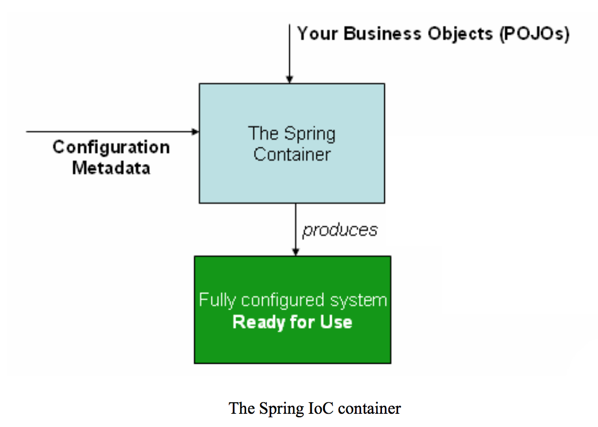

### IoC (Inverse of Control)
Inverse (of Control) is a process whereby 
1. objects define their dependencies (other objects they work with) only through
    - constructor arguments (to a factory method)
     or
    - properties that are set on the object instance after it is constructed or returned from a factory method
2. the container then **injects** those dependencies when it creates the bean

3. the container also manages the bean

   

### Ioc Container

- The configuration metadata is represented in XML, Java annotations, or Java code.
